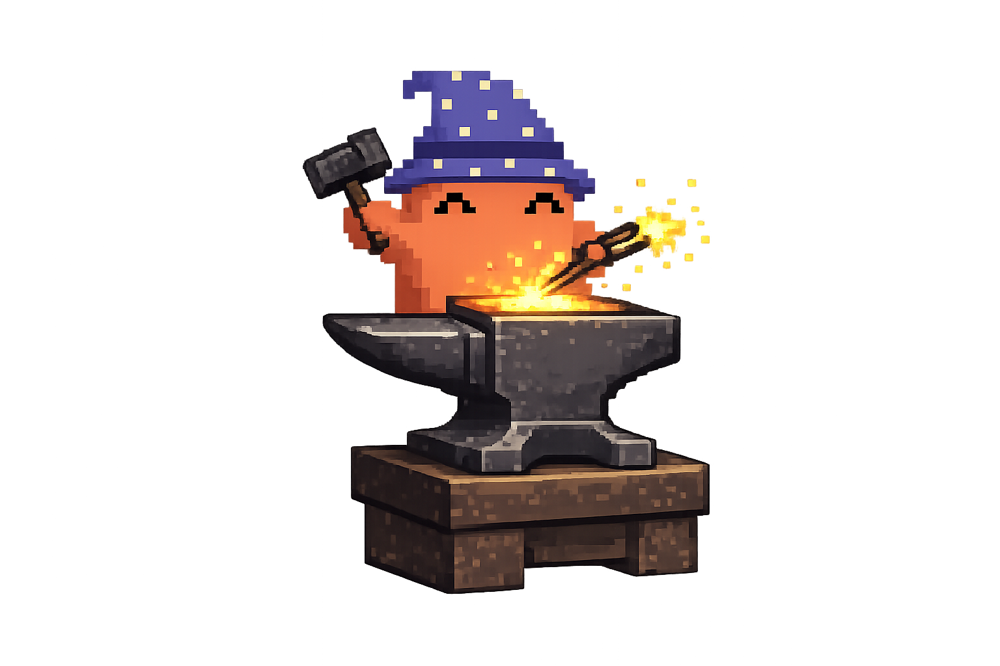

<p align="center">
  
</p>

<h1 align="center">Forge</h1>

<p align="center">a blacksmith for agentic workflows</p>

<p align="center"><em>Forge an issue into a shipped fix: heat it (implement), hammer it (review), then temper it (refactor).</em></p>

## Why this exists

Most "agent does the whole task" tools have the same problem: they start editing your code before you've agreed on what they're going to do. By the time you see the plan, it's already half-built, and unwinding a wrong assumption costs more than writing the fix yourself would have.

Forge splits the work in half with a single gate in the middle. The first half reads the issue, picks the branch, gathers just enough context, and writes you a plan. Then it stops. Nothing touches the codebase until you say "yes, implement." The second half, which runs only after you approve, does the actual work: implement, review until the reviewers stop complaining, propose refactors, file any spin-off issues, and help you commit or open a PR.

If you want it to run unattended, `automode` drops the gates. Even then it will never commit, push, or write back to your tracker on its own. That floor doesn't move.

## Features

- **A plan you sign off on first.** Part 1 ends with one proposal and waits. Nothing gets edited until you say "yes, implement", so a wrong assumption costs a sentence instead of a rewrite. `automode` lifts the wait, never the no-commit-without-asking floor.
- **Re-hydration that keeps discipline fresh.** Before each implement and refactor turn, forge compacts the conversation to drop stale reviewer transcript, then re-sources the Karpathy guidelines. The clean-code rules stay loaded on every pass instead of fading as the window fills, and the compaction keeps the token bill down.
- **Self-evolution at the end of a run.** When forge hits a caveat it could have sidestepped, it offers to write the lesson back: a new skill, a rule in your agent guide, or a note in project memory. The next session starts ahead of this one. The idea comes from the Hermes agent's self-improving workflow, pointed here at whatever agent runs the skill rather than at one framework.
- **One `/goal`, verified before it ships.** Forge turns the issue's acceptance criteria into a single `/goal` at the start, so the whole run aims at the same target. Step 12 won't assemble a commit until that goal actually runs green; a command that exits 0 without running any tests counts as not done.
- **Isolated worktrees when you want them.** Pass the `worktree` flag and forge builds the fix in a sibling git worktree instead of switching your current branch in place. Your working tree stays where it is, and the run ends with a reminder to remove the worktree once you're done.
- **Flags that stack.** Test-first, a security pass, library-doc lookup, CI watching, extra reviewers. Turn on what a job needs, in any combination, in a single invocation.
- **Trackers and hosts it already speaks.** GitHub, GitLab, Jira, and Linear, plus a mode that enters straight into reviewing an existing PR. Forge follows your repo's own branch and commit conventions instead of imposing its own.
- **Not wired to one assistant.** "The agent" is whatever runtime runs the skill. The config paths, the review engine, and the interview UI all adapt to the host.

## Install

Run the installer straight from `curl`. It checks what you already have and skips it, so a second run is safe.

```sh
sh -c "$(curl -fsSL https://raw.githubusercontent.com/radimsem/forge-skills/main/install.sh)"
```

Pass flags after a `--`. A fully non-interactive run, for example:

```sh
sh -c "$(curl -fsSL https://raw.githubusercontent.com/radimsem/forge-skills/main/install.sh)" -- -y
```

The full set:

```
-y, --yes        non-interactive (auto-accept everything)
--skills-only    bare skills only, skip the Claude Code plugins
--force          reinstall even when a dependency looks present
--agents "a,b"   install onto specific agents (default: auto-detect your installed agents)
-h, --help       full option list
```

The installer pulls in everything forge composes (see [What forge uses](#what-forge-uses)) and installs forge last, using `npx skills` for the bare skills and `claude plugin` for the reviewer plugins. On a non-Claude-Code host, pass `--skills-only` to skip the plugin step.

Once it's installed, forge wakes up on `/forge <ref>` or any phrasing that matches the trigger in [`SKILL.md`](skills/forge/SKILL.md).

## How it works

Twelve numbered steps, split by one gate.

```
Part 1 — Gate (1–6):        classify → fetch → branch → context → propose → [GATE] approve
Part 2 — Lifecycle (7–12):  implement → review loop → refactor → spin-off → self-evolve → close
```

Part 1 is the contract. It reads the issue or ticket, works out the right branch from your repo's own conventions, reads only the files the issue actually points at (no full-tree sweep), and hands you one proposal: the problem restated, the root cause, the files it will touch, the plan, the pass criteria, and the risks. If a required detail is missing, it interviews you for it instead of guessing.

Part 2 runs on its own once you approve, and only pauses at decisions that are genuinely yours to make: whether to apply a refactor, whether to file a spin-off issue, and the final commit. The review loop repeats until there are zero actionable findings, re-loading clean-code discipline between passes. Step 12 refuses to assemble a commit until the goal you set in Step 7 actually verifies green, because shipping an unproven "done" is the one failure forge is built to prevent.

The full step-by-step contract lives in [`skills/forge/SKILL.md`](skills/forge/SKILL.md).

## Modifier flags

Flags are orthogonal and compose freely. You can stack as many as you want in one invocation. The full matrix, with conflicts and composition rules, is in [`references/flags.md`](skills/forge/references/flags.md).

| Flag | What it does |
|---|---|
| `automode` | Drops the user gates and lets the agent decide the in-between calls. Never auto-commits, auto-pushes, or writes to Jira. |
| `docs` | Works from documentation. The plan goes to `CONTEXT.md`, and grilling runs through `/grill-with-docs`. |
| `tdd` | Writes the failing test first, watches it fail, then implements. |
| `worktree` | Creates a sibling git worktree instead of switching branch in place. |
| `lookup` | Fetches current docs for every library the issue names before proposing. |
| `secure` | Adds a `security-review` pass once the normal review converges. |
| `changelog` | Drafts a changelog entry at close time, in your repo's existing format. |
| `ci-watch` | Polls CI after a push; a red result reopens the review loop. |
| `compress` | Sources a token-saving output skill (`ponytail`, else `caveman`) for the whole session before Step 1. Ignored if neither is installed. |
| `codex` / `codex challenge` | Adds Codex as a reviewer (`challenge` runs an adversarial pass). Claude Code only. |
| `codex impl` | Delegates implementation to Codex (GPT-5.6 Sol/Terra/Luna, auto-tiered by task); Claude reviews the result. Claude Code only. |
| `coderabbit` | Adds CodeRabbit as a reviewer, with rework via `coderabbit:autofix`. Claude Code only. |

The reviewer flags add to the project's own reviewer agents rather than replacing them, and `codex` and `coderabbit` can both run in the same pass.

## Examples

```sh
/forge 42                          # GitHub/GitLab issue 42
/forge fix #123                    # same, different phrasing
/forge PROJ-123                    # Jira ticket (or Linear issue)
/forge linear ENG-42               # force Linear routing
/forge pr 47                       # review-entry mode against an existing PR diff
/forge plan docs/superpowers/plans/x.md#task-3   # implement one plan task directly
```

Stack flags as needed:

```sh
/forge 88 tdd secure               # test-first, with a security pass before close
/forge ticket PROJ-7 docs lookup   # plan from CONTEXT.md, fetch library docs first
/forge 15 automode codex challenge # unattended, adversarial Codex review, stops at the commit
```

The reference token can sit anywhere in the request. "solve issue 42 with tests" works as well as `/forge 42 tdd`.

## Orchestrating many issues at once

`blacksmith-orchestrate` is a wrapper around forge, not a fork of it: it decides which tasks collide on the same files, schedules the colliding ones sequentially, and runs the rest in parallel worktrees at the model tier and forge depth each one earns, then dispatches one ordinary forge run per task. It never reimplements a forge step — every dispatched run is the normal twelve-step workflow above, gate included.

```
Part 1 — Plan (1–5):     normalize → materialize → analyze → schedule → [GATE] battle plan
Part 2 — Execute (6–9):  provision → dispatch waves → relay → close-out
```

Wakes up on `/blacksmith-orchestrate <work-source>` or a request naming several issues, a milestone, or a plan. The full step-by-step contract lives in [`skills/blacksmith-orchestrate/SKILL.md`](skills/blacksmith-orchestrate/SKILL.md).

```sh
/blacksmith-orchestrate 42 43 51 60          # four issues, scheduled by file collisions
/blacksmith-orchestrate milestone 3 automode # a whole milestone, unattended
/blacksmith-orchestrate plan docs/superpowers/plans/x.md   # straight from a written plan
```

## Orchestrator flags

Orchestrator flags are consumed by `blacksmith-orchestrate` itself and are never forwarded to a dispatched forge run. The full matrix, with composition and conflict rules, is in [`references/flags.md`](skills/blacksmith-orchestrate/references/flags.md).

| Flag | What it does |
|---|---|
| `afk` | After a 5-minute quiet timeout, self-verify and merge blocking PRs only; combined with `automode`, also authorizes each dispatched run's own Step 12 commit-and-PR — the single sanctioned exception to forge's never-auto-push floor. |
| `resume` | Resume a run from its ledger instead of starting a new one. |
| `budget <n>` | Token ceiling for the run, with a deterministic degradation ladder. |
| `strict` | No depth downgrade; every task runs full forge. |
| `stack` | Blocked tasks on a soft edge base off the blocker's branch and open stacked PRs; hard-edge blocks still park. |
| `rescout` | Force scout analysis even where dispatch-ready plans exist. |
| `max <n>` | Concurrent implementation agents; default `4`. |
| `dry` | Emit the battle plan and stop; dispatch nothing. |
| `unified` / `split` | Override worktree grouping: `unified` puts a coupled cluster in one worktree behind one PR, `split` gives every task its own. |
| `plan <path>` | Source tasks from a written implementation plan; each plan task becomes one orchestration task. |

Every flag forge understands also passes through unchanged to every dispatched run.

## blueprint

Design it before you forge it: `/blueprint` runs an interactive UI/UX
brainstorming session in the browser. Proposal screens are rendered from the
project's own design language (DESIGN.md + harvested tokens and components);
clicking options, notes, and nit flags assembles a response prompt copied to
your clipboard — paste it back into the session to resolve the round. An
approval gate, a generated spec, and a handoff screen (plans, `/to-tickets`,
or a `/blacksmith-orchestrate` invocation builder) close the loop. The
pipeline reads: **blueprint** (design it) → **forge** (ship one task) →
**blacksmith-orchestrate** (ship many).

## Blueprint flags

| Flag | Effect |
|---|---|
| `fresh` | Force a full design re-harvest, ignoring the `.brainstorm/` cache |
| `terminal` | Skip the browser; run every round in the terminal fallback |
| `resume` | Continue from an existing ledger: restart the server, re-push the last unresolved screen |

## What forge uses

Forge leans on a handful of other skills and plugins, all installed for you by `./install.sh`:

| Dependency | From | Used for |
|---|---|---|
| `tdd`, `grill-me`, `grill-with-docs`, `to-issues`, `diagnose`, `write-a-skill`, `improve-codebase-architecture`, `zoom-out` | [`mattpocock/skills`](https://github.com/mattpocock/skills) | the lifecycle steps and the `tdd`/grilling flags |
| `karpathy-guidelines` | [`forrestchang/andrej-karpathy-skills`](https://github.com/forrestchang/andrej-karpathy-skills) | re-loading clean-code discipline before each implement/refactor pass |
| `superpowers:requesting-code-review`, `superpowers:using-git-worktrees` | [`obra/superpowers`](https://github.com/obra/superpowers) | the default reviewer and the `worktree` flag |
| `codex` plugin | [`openai/codex-plugin-cc`](https://github.com/openai/codex-plugin-cc) | the `codex` flag (Claude Code only) |
| `coderabbit` plugin | [`coderabbitai/skills`](https://github.com/coderabbitai/skills) | the `coderabbit` flag (Claude Code only) |
| `greploop`, `check-pr` | [`greptileai/skills`](https://github.com/greptileai/skills) | the review-loop fallback |

The installer leaves a few things alone, because they belong to your environment rather than to forge. They only need to be present when you reach for the feature that depends on them. `/goal` and `/compact` come from the agent runtime. `security-review` is a Claude Code built-in that the `secure` flag calls. The context7 MCP backs the `lookup` flag, and a tracker MCP backs ticket routing: the Atlassian MCP for Jira, the Linear MCP for Linear issues. Set each up yourself, and only if you use the flag or tracker that asks for it.

## License

[MIT](LICENSE)
